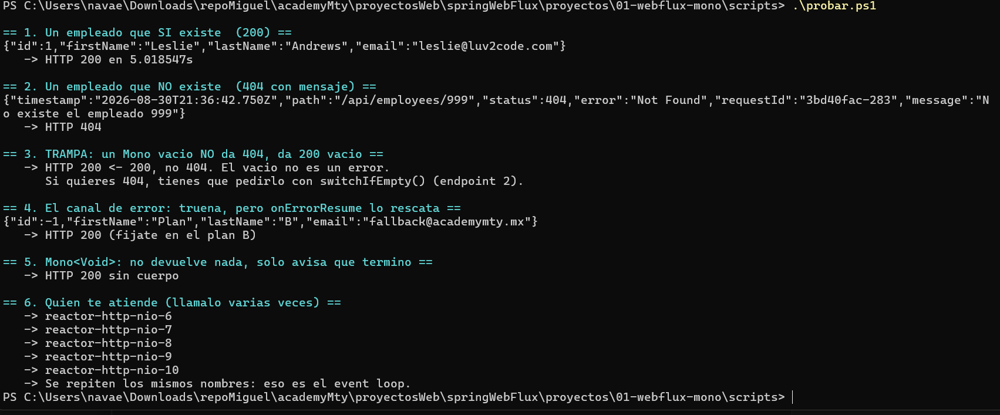
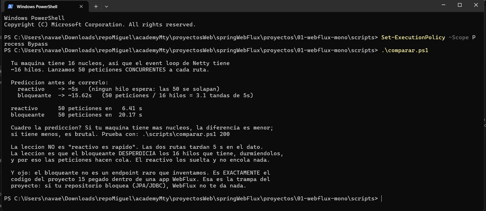
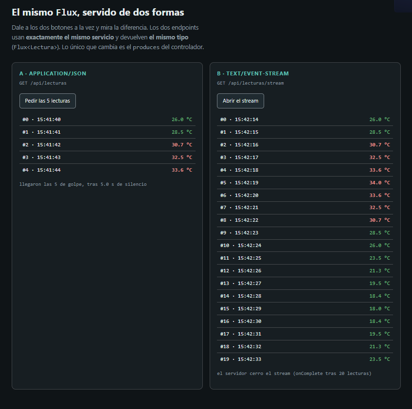
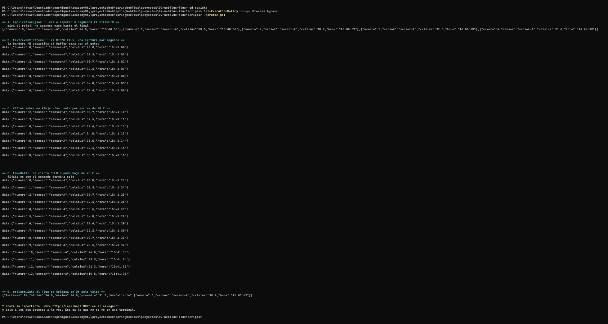

# Programación reactiva con Spring WebFlux

Este repositorio contiene dos proyectos pequeños para entender programación reactiva de forma práctica. El primero trabaja con un solo resultado mediante `Mono`; el segundo genera varios resultados mediante `Flux`.

Los ejemplos permiten observar cómo una aplicación puede atender otras tareas mientras espera una respuesta y cómo puede enviar datos al cliente conforme se producen, sin tener que reunirlos todos primero.

## Contenido

```text
.
|-- 01-webflux-mono/   Ejemplos con un resultado y manejo de errores
|-- 02-webflux-flux/   Flujos de datos y eventos en tiempo real
`-- docs/images/       Resultados de las pruebas
```

## Conceptos principales

### ¿Qué es la programación reactiva?

En una aplicación tradicional es común que un hilo quede detenido mientras espera una consulta, un archivo o una respuesta de otro servicio. En una aplicación reactiva, la operación devuelve una descripción del trabajo pendiente y el hilo queda libre para atender otras solicitudes.

Cuando el dato está listo, el flujo continúa. Esto resulta útil cuando existen muchas operaciones de entrada y salida que pasan parte de su tiempo esperando.

### `Mono`

Un `Mono<T>` puede entregar:

- Un valor.
- Ningún valor.
- Un error.

Se utiliza para consultas por identificador, eliminaciones, confirmaciones y otras operaciones que producen como máximo un resultado.

Un `Mono` vacío no representa un error. Si un recurso inexistente debe responder con `404 Not Found`, es necesario convertir ese resultado vacío en un error, por ejemplo con `switchIfEmpty()`.

### `Flux`

Un `Flux<T>` puede entregar varios valores, desde ninguno hasta una cantidad ilimitada. Cada elemento puede procesarse al llegar, sin esperar a que termine toda la secuencia.

En estos ejemplos se utilizan operadores sencillos:

- `filter()` deja pasar únicamente los elementos que cumplen una condición.
- `take()` limita cuántos elementos se reciben.
- `takeUntil()` mantiene abierto el flujo hasta que se cumple una condición.
- `collectList()` reúne todos los elementos y convierte el `Flux` en un único `Mono<List<T>>`.

## Requisitos

- Java 21 o una versión compatible con el proyecto.
- PowerShell en Windows, o una terminal compatible con Bash en Linux y macOS.
- `curl` para ejecutar las pruebas desde la terminal.

No es necesario instalar Maven de forma global porque ambos proyectos incluyen Maven Wrapper.

## Proyecto 1: un resultado con `Mono`

Este proyecto simula un repositorio de empleados. La consulta tarda cinco segundos para representar la espera que podría causar una base de datos o un servicio externo.

La aplicación se ejecuta en `http://localhost:8074`.

### Iniciar el proyecto

En Windows:

```powershell
cd 01-webflux-mono
.\mvnw.cmd spring-boot:run
```

En Linux o macOS:

```bash
cd 01-webflux-mono
./mvnw spring-boot:run
```

### Endpoints disponibles

| Método | Ruta | Descripción |
|---|---|---|
| `GET` | `/api/employees/{id}` | Busca un empleado y responde con `404` cuando no existe. |
| `GET` | `/api/employees-suave/{id}` | Muestra que un `Mono` vacío termina correctamente y puede producir una respuesta vacía. |
| `GET` | `/api/employees/{id}/boom` | Genera un error y lo sustituye por un valor alternativo con `onErrorResume()`. |
| `DELETE` | `/api/employees/{id}` | Usa `Mono<Void>` para indicar únicamente que la operación terminó. |
| `GET` | `/api/hilo` | Muestra el hilo que atendió la solicitud y la cantidad de procesadores disponibles. |
| `GET` | `/api/mvc/employees/{id}` | Versión bloqueante incluida para comparar su comportamiento. |

### Probar los casos de `Mono`

Con la aplicación encendida, abre otra terminal y ejecuta:

```powershell
cd 01-webflux-mono
.\scripts\probar.ps1
```

En Linux o macOS:

```bash
cd 01-webflux-mono
./scripts/probar.sh
```

La prueba consulta un empleado existente, comprueba las dos formas de tratar un resultado vacío, recupera un flujo que falla, ejecuta una operación sin cuerpo y muestra los nombres de los hilos utilizados.

#### Resultado



Los nombres `reactor-http-nio-*` se repiten porque Netty trabaja con un grupo limitado de hilos conocido como *event loop*. No se crea un hilo nuevo para cada solicitud.

### Comparar el comportamiento reactivo y bloqueante

El siguiente script lanza 50 solicitudes concurrentes contra dos rutas que simulan la misma espera de cinco segundos:

```powershell
cd 01-webflux-mono
.\scripts\comparar.ps1
```

En Linux o macOS:

```bash
cd 01-webflux-mono
./scripts/comparar.sh
```

También se puede cambiar la cantidad de solicitudes. Por ejemplo:

```powershell
.\scripts\comparar.ps1 200
```

#### Resultado



En la ejecución mostrada, 50 solicitudes reactivas terminaron en aproximadamente 6.41 segundos, mientras que las bloqueantes tardaron cerca de 20.17 segundos. El tiempo exacto cambia según el equipo.

La diferencia no significa que el dato individual tarde menos. Ambas rutas simulan una espera de cinco segundos. La ventaja es que la versión reactiva libera los hilos durante esa espera, mientras que la versión bloqueante los mantiene ocupados y provoca que otras solicitudes formen una cola.

## Proyecto 2: varios resultados con `Flux`

Este proyecto simula un sensor que produce una lectura de temperatura por segundo. Los valores siguen un patrón predecible entre aproximadamente 18 y 34 grados, lo que facilita comprobar filtros y condiciones de cierre.

La aplicación se ejecuta en `http://localhost:8075`.

### Iniciar el proyecto

En Windows:

```powershell
cd 02-webflux-flux
.\mvnw.cmd spring-boot:run
```

En Linux o macOS:

```bash
cd 02-webflux-flux
./mvnw spring-boot:run
```

### Endpoints disponibles

| Ruta | Tipo de respuesta | Descripción |
|---|---|---|
| `/api/lecturas` | `application/json` | Espera cinco lecturas y entrega el arreglo completo. |
| `/api/lecturas/stream` | `text/event-stream` | Envía una lectura por segundo y termina después de 20 valores. |
| `/api/lecturas/alertas?umbral=30` | `text/event-stream` | Solo entrega temperaturas superiores al umbral. |
| `/api/lecturas/hasta/20` | `text/event-stream` | Entrega lecturas hasta encontrar una temperatura menor al límite. |
| `/api/lecturas/resumen` | `application/json` | Reúne diez lecturas y calcula mínimo, máximo, promedio y valor más alto. |

### Probar el flujo desde la terminal

Con la aplicación encendida, ejecuta el script desde otra terminal:

```powershell
cd 02-webflux-flux
.\scripts\probar.ps1
```

En Linux o macOS:

```bash
cd 02-webflux-flux
./scripts/probar.sh
```

La opción `-N` utilizada por `curl` desactiva su búfer. Así es posible ver cada evento en cuanto llega, en lugar de recibirlos todos al final.

#### Resultado



La salida permite observar varias diferencias:

- La respuesta JSON aparece completa después de cinco segundos.
- El flujo de eventos muestra una lectura nueva cada segundo.
- El filtro solo deja pasar temperaturas superiores a 30 grados.
- `takeUntil()` cierra la conexión cuando la temperatura baja del límite.
- `collectList()` espera diez lecturas y produce un solo resumen.

### Comparar JSON y eventos desde el navegador

Abre [http://localhost:8075](http://localhost:8075) y pulsa los dos botones casi al mismo tiempo.

El panel izquierdo solicita cinco lecturas como JSON. Aunque el servidor genera una por segundo, el navegador las muestra juntas cuando la respuesta termina. El panel derecho usa eventos enviados por el servidor y añade cada lectura en cuanto está disponible.

#### Resultado



Los dos endpoints utilizan el mismo `Flux<Lectura>`. La diferencia visible se debe al tipo de contenido declarado por el controlador:

- `application/json` representa una respuesta completa.
- `text/event-stream` mantiene la conexión abierta y entrega eventos progresivamente.

## Ejecutar las pruebas automatizadas

Cada proyecto contiene pruebas con `StepVerifier`, una herramienta de Reactor que permite comprobar los valores, errores y señales de finalización de un flujo.

En Windows:

```powershell
cd 01-webflux-mono
.\mvnw.cmd test

cd ..\02-webflux-flux
.\mvnw.cmd test
```

En Linux o macOS:

```bash
cd 01-webflux-mono
./mvnw test

cd ../02-webflux-flux
./mvnw test
```

## Ideas importantes

- `Mono` representa como máximo un resultado; `Flux` representa una secuencia.
- Un flujo vacío no es lo mismo que un flujo con error.
- Los errores pueden transformarse o recuperarse dentro de la cadena reactiva.
- WebFlux funciona mejor cuando toda la cadena evita operaciones bloqueantes.
- Un flujo puede enviarse como una respuesta completa o como eventos progresivos.
- La programación reactiva no elimina la espera del sistema externo; permite aprovechar mejor los hilos mientras esa espera ocurre.
