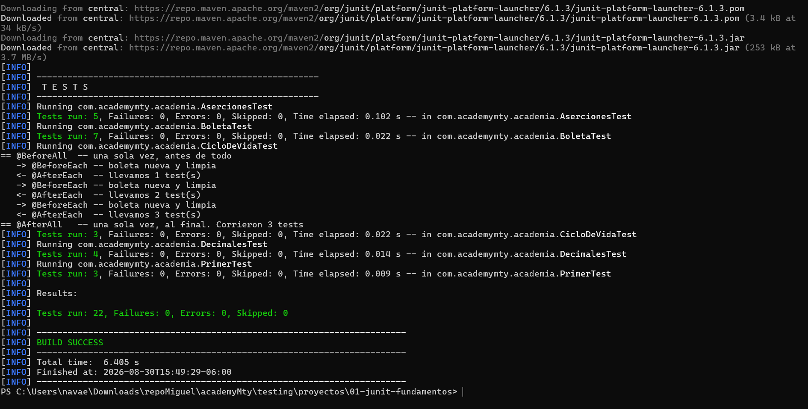
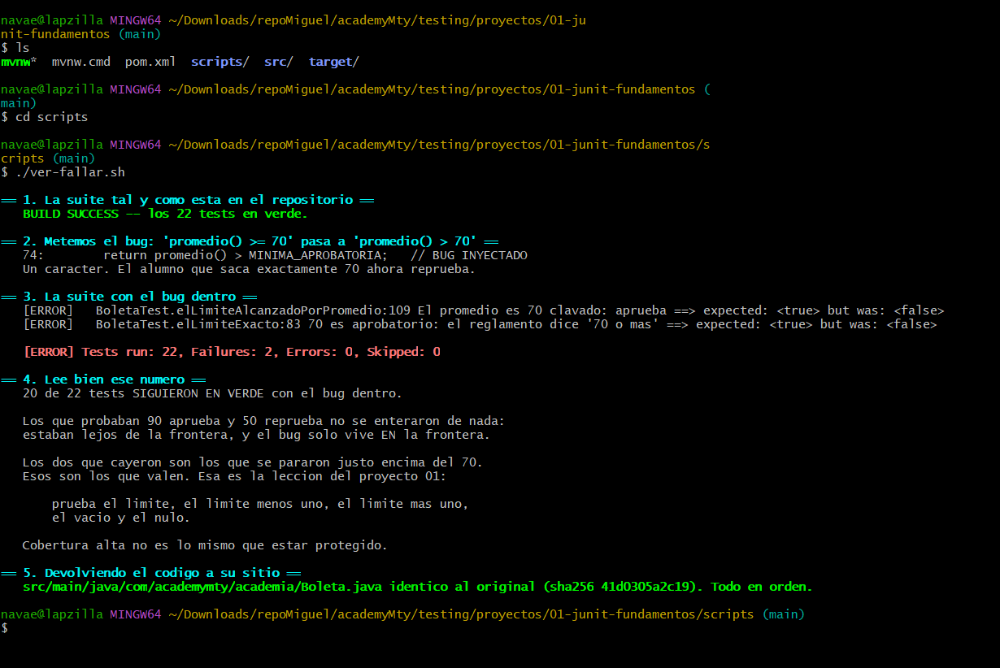
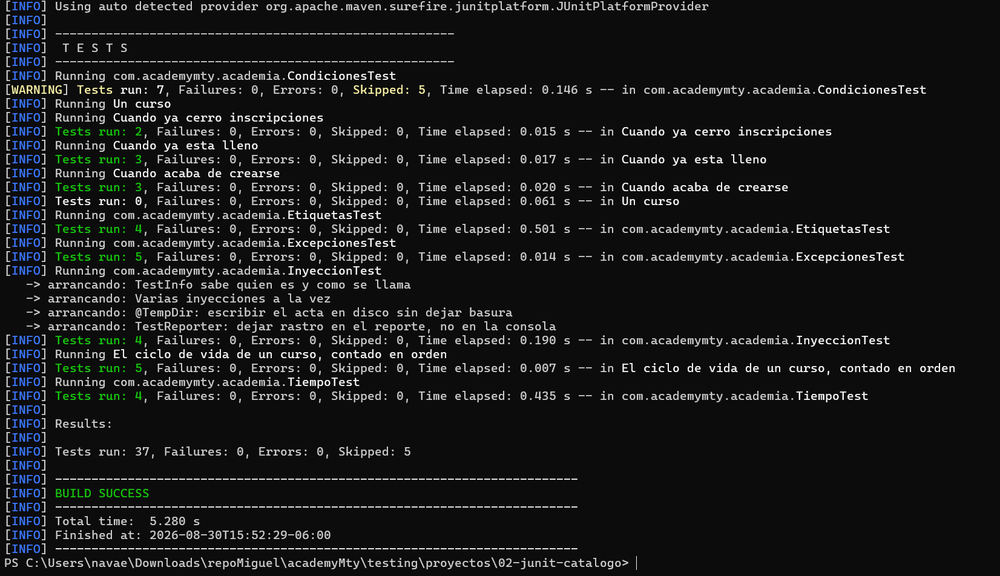
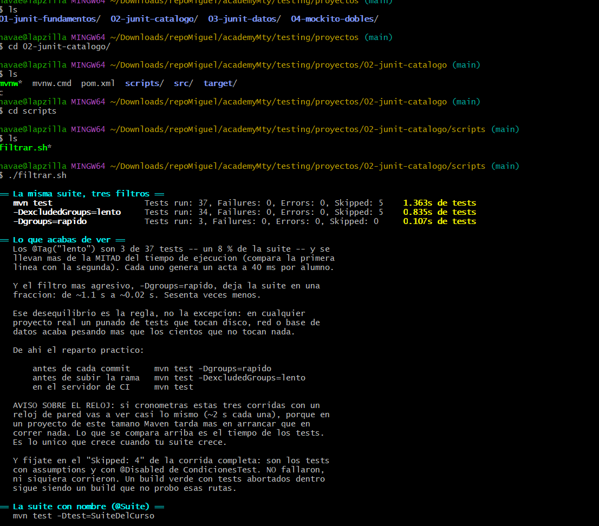
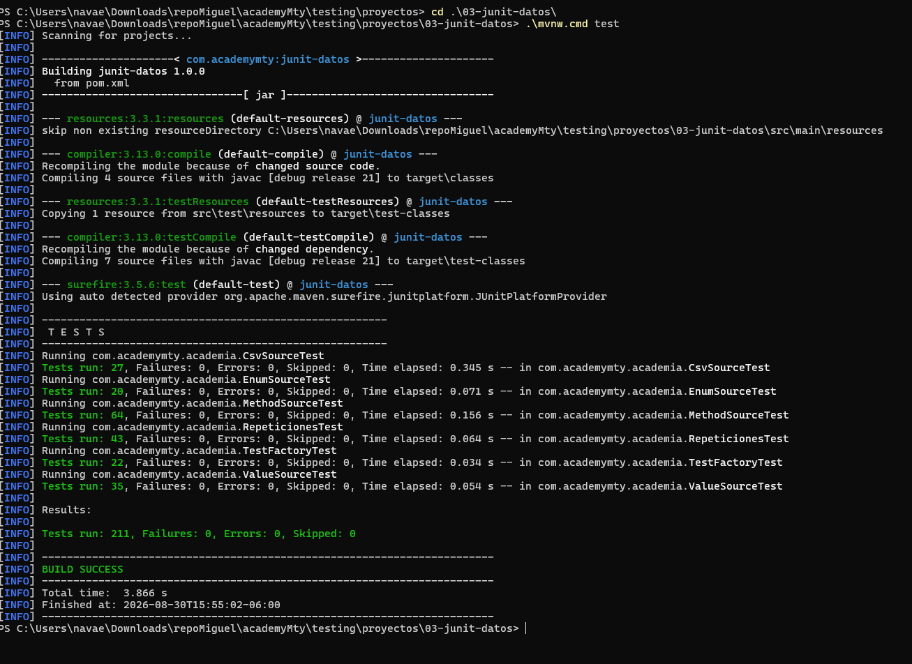
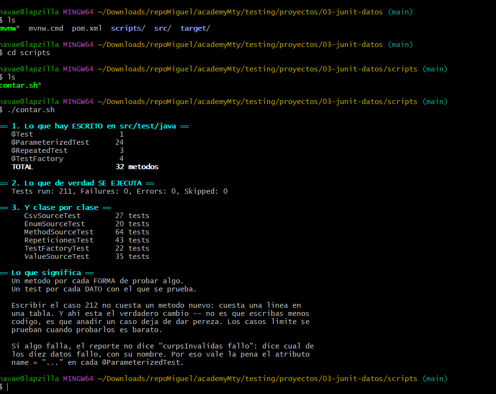
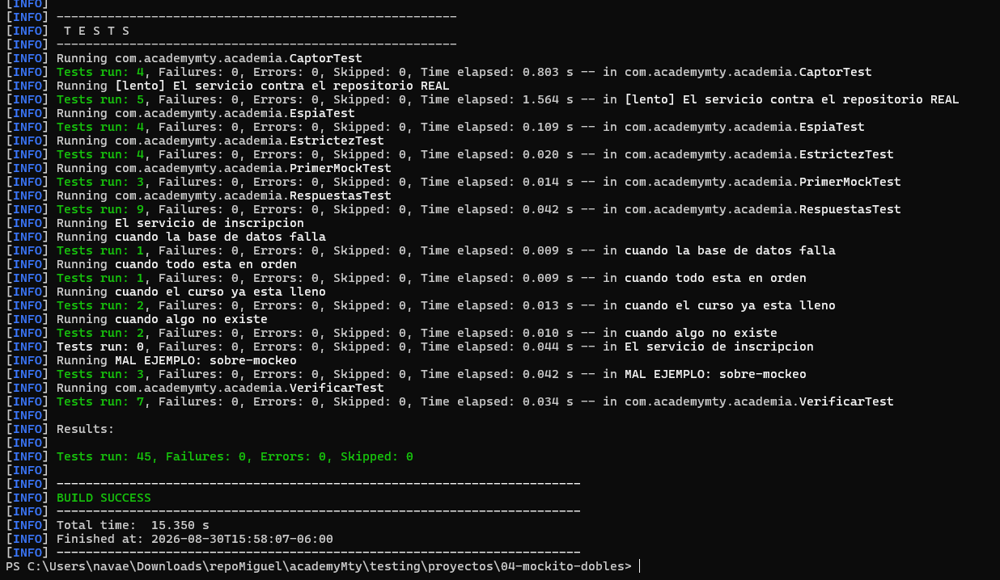
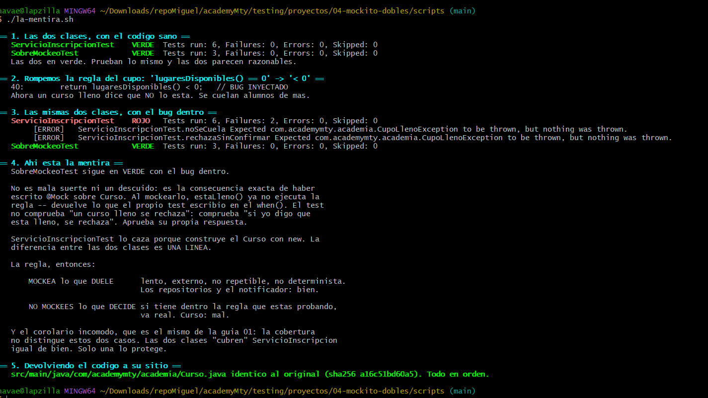
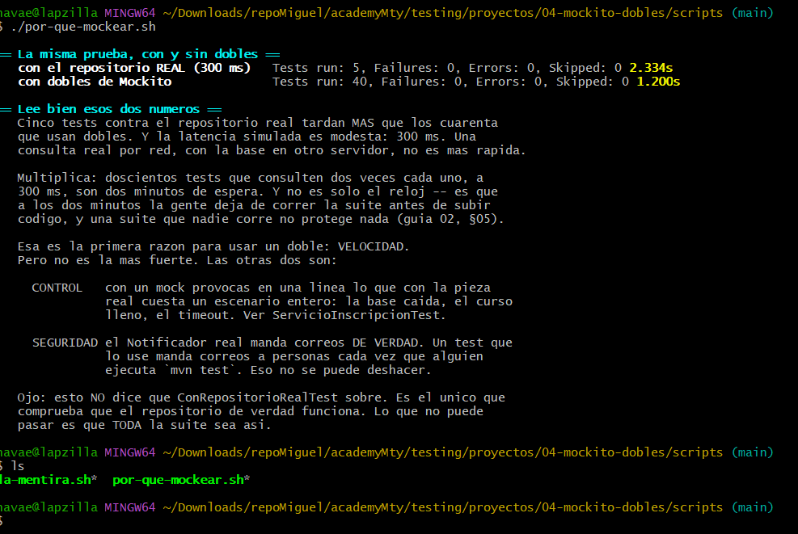

# Pruebas unitarias con JUnit y Mockito

Este repositorio reúne cuatro proyectos pequeños para aprender pruebas unitarias en Java. Los ejemplos avanzan desde la estructura básica de una prueba con JUnit hasta el uso de dobles de prueba con Mockito.

Cada proyecto es independiente y tiene su propio archivo `pom.xml`, Maven Wrapper, código de ejemplo y pruebas. Las imágenes incluidas muestran el resultado real de ejecutar las pruebas y los scripts.

## Requisitos

Para trabajar con los proyectos necesitas:

- Java 21.
- Una terminal.
- Conexión a Internet durante la primera ejecución, ya que Maven descargará las dependencias.
- Git Bash, WSL o una terminal compatible con Bash para ejecutar los archivos `.sh` de la carpeta `scripts`.

Puedes comprobar la versión de Java con:

```bash
java -version
```

La salida debe indicar Java 21 o una versión compatible con proyectos compilados para Java 21.

## Cómo ejecutar un proyecto

Primero entra en la carpeta del proyecto que quieras revisar. Por ejemplo:

```bash
cd 01-junit-fundamentos
```

En Windows PowerShell o Símbolo del sistema ejecuta:

```powershell
.\mvnw.cmd test
```

En Git Bash, Linux o macOS ejecuta:

```bash
./mvnw test
```

Maven compila el código, ejecuta las pruebas y muestra un resumen. `BUILD SUCCESS` significa que la ejecución terminó correctamente. Una prueba omitida aparece como `Skipped`: no falló, pero tampoco se ejecutó.

Para abrir otro proyecto, vuelve a la carpeta principal con `cd ..` y entra en la carpeta correspondiente.

## 1. Fundamentos de JUnit

Carpeta: [`01-junit-fundamentos`](01-junit-fundamentos)

Este proyecto presenta la estructura de una prueba y las herramientas básicas de JUnit. Usa ejemplos de alumnos y boletas para comprobar resultados de una forma fácil de entender.

### Conceptos principales

- **`@Test`**: marca un método como una prueba que JUnit debe ejecutar.
- **Preparar, actuar y comprobar**: primero se crean los datos, después se ejecuta la acción y al final se compara el resultado esperado con el resultado real.
- **Aserciones**: permiten verificar valores. El proyecto usa comprobaciones como igualdad, verdadero o falso, valores nulos, arreglos y varias comprobaciones agrupadas con `assertAll`.
- **Mensajes de error**: explican qué condición no se cumplió cuando una prueba falla.
- **Ciclo de vida**: `@BeforeEach` y `@AfterEach` se ejecutan antes y después de cada prueba; `@BeforeAll` y `@AfterAll` se ejecutan una sola vez para toda la clase.
- **Pruebas con decimales**: comparan números usando una tolerancia para evitar errores pequeños de precisión.
- **Casos límite**: revisan valores importantes como 69, 70 y 71, además de datos vacíos o nulos. Probar solo valores cómodos puede dejar errores sin detectar.

### Ejecutar todas las pruebas

```bash
cd 01-junit-fundamentos
./mvnw test
```

En Windows PowerShell puedes cambiar la última línea por `.\mvnw.cmd test`.

El resultado mostrado en la siguiente imagen contiene **22 pruebas correctas**, sin fallos, errores ni pruebas omitidas.



### Script `ver-fallar.sh`

Este script demuestra por qué una prueba también debe verse fallar. Cambia temporalmente la regla de aprobación de `promedio >= 70` a `promedio > 70`, ejecuta las pruebas y después restaura el archivo original.

Desde Git Bash, WSL, Linux o macOS:

```bash
cd 01-junit-fundamentos
./scripts/ver-fallar.sh
```

El script provoca un error de forma intencional. De las 22 pruebas, solo fallan las 2 que revisan exactamente el límite de 70; las otras 20 continúan en verde. Esto enseña que tener muchas pruebas no es suficiente si no se eligen buenos casos. Al terminar, el script compara el archivo restaurado con el original para confirmar que el código quedó intacto.



## 2. Catálogo de herramientas de JUnit

Carpeta: [`02-junit-catalogo`](02-junit-catalogo)

Este proyecto amplía el uso de JUnit con pruebas de excepciones, tiempo, condiciones, organización y selección de grupos. Los ejemplos se apoyan en un curso con cupo e inscripciones.

### Conceptos principales

- **Excepciones**: `assertThrows` comprueba que una acción lance el error esperado y `assertDoesNotThrow` confirma que termine sin errores.
- **Tiempo máximo**: `assertTimeout` comprueba que una operación termine dentro del tiempo permitido.
- **Condiciones**: las assumptions permiten ejecutar una prueba solo cuando se cumple una condición del entorno.
- **Pruebas deshabilitadas**: `@Disabled` deja una prueba fuera de la ejecución de manera explícita.
- **Pruebas anidadas**: `@Nested` agrupa escenarios relacionados y ayuda a leer el reporte como una historia: curso nuevo, curso lleno o inscripciones cerradas.
- **Etiquetas**: `@Tag` clasifica pruebas, por ejemplo como `rapido` o `lento`, para ejecutar solo el grupo necesario.
- **Orden de ejecución**: permite definir un orden cuando un ejemplo realmente lo necesita. En pruebas normales conviene que cada caso sea independiente.
- **Inyección de datos de JUnit**: ejemplos como `TestInfo`, `TestReporter` y `@TempDir` permiten recibir información o una carpeta temporal dentro de una prueba.
- **Suites**: `@Suite` reúne varias clases de prueba bajo un nombre y un objetivo común.

### Ejecutar todas las pruebas

```bash
cd 02-junit-catalogo
./mvnw test
```

En Windows PowerShell usa `.\mvnw.cmd test`.

La ejecución completa muestra **37 pruebas**, sin fallos ni errores. Cinco aparecen como omitidas porque usan assumptions o `@Disabled`; una prueba omitida no es lo mismo que una prueba aprobada.



### Script `filtrar.sh`

El script ejecuta la misma suite con tres filtros y compara el tiempo que ocupan las pruebas:

```bash
cd 02-junit-catalogo
./scripts/filtrar.sh
```

La primera ejecución corre toda la suite, la segunda excluye el grupo `lento` y la tercera ejecuta únicamente el grupo `rapido`. En la captura, la suite completa tarda 1.363 segundos de pruebas, sin las lentas tarda 0.835 segundos y el grupo rápido tarda 0.107 segundos. También ejecuta la suite con nombre `SuiteDelCurso`.

La idea es sencilla: durante el desarrollo se puede usar un grupo rápido para recibir resultados pronto, mientras que la integración continua debe ejecutar la suite completa. Los tiempos pueden cambiar según el equipo; lo importante es comparar la diferencia entre los grupos.



## 3. Pruebas con muchos datos

Carpeta: [`03-junit-datos`](03-junit-datos)

Este proyecto muestra cómo probar una misma regla con muchos valores sin copiar el mismo método una y otra vez. Incluye ejemplos para calificaciones, niveles y validación de CURP.

### Conceptos principales

- **Pruebas parametrizadas**: `@ParameterizedTest` ejecuta el mismo método varias veces, una por cada dato recibido.
- **`@ValueSource`**: proporciona una lista sencilla de textos, números u otros valores básicos.
- **`@EnumSource`**: usa los valores de un `enum` como entradas de la prueba.
- **`@MethodSource`**: obtiene casos desde un método. Es útil cuando cada caso necesita varios datos u objetos.
- **`@CsvSource`**: escribe filas de datos directamente en la prueba.
- **`@CsvFileSource`**: lee los casos desde un archivo CSV, como `curps-validas.csv`.
- **Pruebas repetidas**: `@RepeatedTest` ejecuta varias veces el mismo caso para revisar comportamientos repetibles.
- **Pruebas dinámicas**: `@TestFactory` crea pruebas durante la ejecución a partir de una colección de datos.
- **Nombre de cada caso**: un nombre descriptivo permite saber exactamente qué dato falló sin revisar toda la tabla.

### Ejecutar todas las pruebas

```bash
cd 03-junit-datos
./mvnw test
```

En Windows PowerShell usa `.\mvnw.cmd test`.

El proyecto ejecuta **211 pruebas**, todas correctas. Aunque el código tiene pocos métodos de prueba, cada conjunto de datos genera una ejecución independiente.



### Script `contar.sh`

Este script compara la cantidad de métodos escritos con la cantidad de pruebas que JUnit ejecuta realmente:

```bash
cd 03-junit-datos
./scripts/contar.sh
```

El resultado cuenta 1 método con `@Test`, 24 con `@ParameterizedTest`, 3 con `@RepeatedTest` y 4 fábricas con `@TestFactory`: **32 métodos escritos que producen 211 pruebas ejecutadas**. Esto permite agregar nuevos casos escribiendo datos en lugar de duplicar métodos completos.



## 4. Dobles de prueba con Mockito

Carpeta: [`04-mockito-dobles`](04-mockito-dobles)

Este proyecto prueba un servicio de inscripciones que depende de repositorios y de un notificador. Mockito reemplaza las dependencias lentas o externas con objetos controlados para que las pruebas sean rápidas, seguras y repetibles.

### Conceptos principales

- **Doble de prueba**: objeto que ocupa temporalmente el lugar de una dependencia real.
- **Mock**: doble creado por Mockito. Permite decidir qué devuelve una dependencia y comprobar cómo fue utilizada.
- **`@Mock`**: crea un mock automáticamente al usar `MockitoExtension`.
- **`@InjectMocks`**: construye el objeto que se prueba e introduce sus mocks. En algunos casos construirlo manualmente puede ser más claro.
- **Stubbing con `when(...).thenReturn(...)`**: programa la respuesta de un mock.
- **Respuestas y errores**: un mock también puede devolver respuestas consecutivas o lanzar una excepción con `thenThrow`.
- **Matchers**: `any`, `anyString` y `eq` permiten aceptar argumentos que cumplen una condición. Si un argumento usa matcher, los demás también deben usarlo.
- **Verificación**: `verify` comprueba que ocurrió una llamada. `times`, `atLeast` y `atMost` revisan cuántas veces ocurrió.
- **Comportamiento que no debe ocurrir**: `never` y `verifyNoInteractions` comprueban que no se enviaron mensajes ni se usaron dependencias cuando no correspondía.
- **Orden**: `InOrder` verifica el orden de llamadas cuando ese orden forma parte de la regla.
- **Captor**: `ArgumentCaptor` guarda el argumento enviado a un colaborador para revisar su contenido.
- **Spy**: envuelve un objeto real y permite observarlo o cambiar solo una parte de su comportamiento. Debe usarse con cuidado porque sigue ejecutando código real.
- **Estrictez**: Mockito detecta configuraciones que no se usan. Esto ayuda a mantener cada prueba enfocada en el camino que realmente recorre.
- **Sobre-mockeo**: ocurre cuando se reemplaza con un mock el objeto que contiene la regla de negocio. La prueba puede quedar verde aunque la regla real esté rota.

Una regla práctica del proyecto es: usa mocks para lo lento, externo o difícil de repetir; conserva reales los objetos rápidos que contienen las decisiones del negocio.

### Ejecutar todas las pruebas

```bash
cd 04-mockito-dobles
./mvnw test
```

En Windows PowerShell usa `.\mvnw.cmd test`.

La ejecución muestra **45 pruebas correctas**, sin fallos, errores ni pruebas omitidas.



### Script `la-mentira.sh`

Este script compara una prueba que usa un `Curso` real con otra que usa un mock del curso:

```bash
cd 04-mockito-dobles
./scripts/la-mentira.sh
```

Primero las dos clases pasan. Después el script cambia temporalmente la regla de cupo. La clase `ServicioInscripcionTest`, que usa un curso real, detecta el error y presenta 2 fallos; `SobreMockeoTest` conserva sus 3 pruebas en verde porque el propio test inventó la respuesta del curso. Al final se restaura el archivo y se verifica que sea idéntico al original.

La captura demuestra el peligro del sobre-mockeo: una prueba verde no garantiza protección si el mock reemplazó precisamente la regla que se quería comprobar.



### Script `por-que-mockear.sh`

Este script muestra las ventajas prácticas de usar dobles:

```bash
cd 04-mockito-dobles
./scripts/por-que-mockear.sh
```

En la captura, 5 pruebas con el repositorio real tardan 2.334 segundos, mientras que 40 pruebas con dobles tardan 1.200 segundos. Además de mejorar la velocidad, los mocks dan control para provocar errores difíciles y evitan acciones reales, como mandar correos durante una prueba.

Esto no significa que nunca deban existir pruebas con implementaciones reales. Significa que conviene reservarlas para comprobar la integración y usar dobles cuando se necesita velocidad, control y seguridad.



## Comandos útiles

Ejecutar una sola clase de prueba:

```bash
./mvnw test -Dtest=NombreDeLaClase
```

Ejecutar una sola prueba de una clase:

```bash
./mvnw test -Dtest=NombreDeLaClase#nombreDelMetodo
```

Ejecutar solamente las pruebas con la etiqueta `rapido` en el proyecto 02:

```bash
./mvnw test -Dgroups=rapido
```

Ejecutar todas excepto las etiquetadas como `lento`:

```bash
./mvnw test -DexcludedGroups=lento
```

En PowerShell sustituye `./mvnw` por `.\mvnw.cmd`. Si PowerShell interpreta de forma especial un argumento que contiene `#`, colócalo entre comillas.
